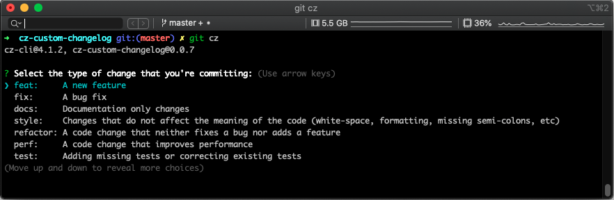

# cz-custom-changelog

[![npm package][npm-image]][npm-url] [](https://www.npmjs.com/package/rn-ticker)

## Install

```
npm install -g commitizen cz-custom-changelog
yarn global add commitizen cz-custom-changelog
```

In order to use cz-custom-changelog as an adapter on commitizen you will need to create a .czrc file on your root directory :

```json
{
  "path": "cz-custom-changelog"
}
```

## How to use it

```
git cz
```

## Custom Configuration

### Environment variables

The following environment varibles can be used to override any default configuration or package.json based configuration.

```js
CZ_BODY = defaultBody // ''
CZ_MAX_HEADER_WIDTH = maxHeaderWidth // 72
CZ_MAX_LINE_WIDTH = maxLineWidth // 100
CZ_SCOPE = defaultScope // ''
CZ_SUBJECT = defaultSubject // ''
CZ_SUBJECT_LOWER_CASE = defaultSubjectLowerCase // false
CZ_TYPE = defaultType // ''
```

### package.json

Like commitizen, you specify the configuration of cz-custom-changelog through the package.json's `config.commitizen` key.

```json5
{
// ...  default values
    "config": {
        "commitizen": {
            "path": "./node_modules/cz-custom-changelog",
            "maxHeaderWidth": 72,
            "maxLineWidth": 100,
            "defaultType": "",
            "defaultScope": "",
            "defaultSubject": "",
            "defaultBody": "",
            "defaultIssues": "",
            "types": {
              ...
              "feat": {
                "description": "A new feature",
                "title": "Features"
              },
              ...
            }
        }
    }
// ...
}
```

### Commitlint

If using the [commitlint](https://github.com/custom-changelog/commitlint) js library, the "maxHeaderWidth" configuration property will default to the configuration of the "header-max-length" rule instead of the hard coded value of 72. This can be ovewritten by setting the 'maxHeaderWidth' configuration in package.json or the CZ_MAX_HEADER_WIDTH environment variable.

<!-- Markdown link & img dfn's -->

[npm-image]: https://img.shields.io/npm/v/cz-custom-changelog.svg?style=flat-square
[npm-url]: https://www.npmjs.org/package/cz-custom-changelog
[npm-downloads]: https://img.shields.io/npm/dm/datadog-metrics.svg?style=flat-square
